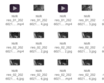
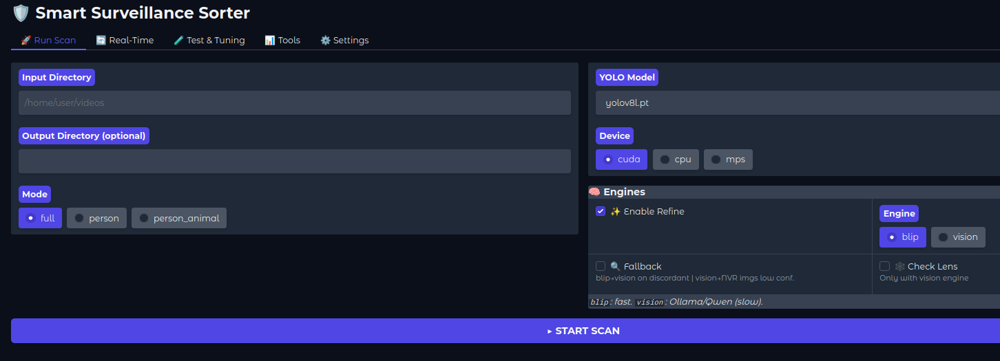

# Smart Surveillance Sorter


Process and organize NVR surveillance recordings using a local AI pipeline based on YOLO, CLIP, BLIP, and Vision models (Ollama).

The system supports both historical and continuous processing modes, allowing it to analyze existing video archives or monitor active directories where new recordings are continuously added (e.g., NVR daily folders).

Once video files are finalized, they are processed through a multi-stage inference pipeline and categorized into structured classes: PERSON, ANIMAL, VEHICLE, or OTHERS.

Processed outputs can be redirected into fully configurable directory structures (e.g., monthly archives or consolidated categorized datasets), independent of the original NVR storage layout. Users can define custom organization schemes without affecting the underlying AI classification..

<div align="center">
  
</div>

---

## Table of Contents
- [Features](#features)
- [Quick Start](#quick-start)
- [First Configuration](#configuration)
- [Benchmarks](#benchmarks)

## Documentation

| Getting Started | Configuration | Advanced | Benchmarks |
|----------------|---------------|----------|------------|
| [How It Works](docs/how-works.md) | [Camera Config](docs/cameras-config.md) | [Real-Time & Resume](docs/realtime-resume.md) | [Benchmarks Index](docs/benchmarks-index.md) |
| [WebUI Guide](docs/webui.md) | [Tuning Guide](docs/tuning-guide.md) | [Lens Health Check](docs/lens-health.md) | [Model Comparison](docs/model-comparison.md) |
| [CLI Reference](docs/cli-usage.md) | [CLIP/BLIP Settings](docs/blip-clip-config.md) | [Manual Install](docs/manual-install.md) | [YOLO Model Comparison](docs/yolo-model-comparison.md) |
| [Testing Guide](docs/testing-guide.md) | [YOLO Tuning](docs/yolo-tuning.md) | [AMD GPU Setup](docs/gpu-setup-amd.md) | [Mode Comparison](docs/mode-comparison.md) |
| | | | [Edge Cases](docs/edge-cases.md) |
---

## Features

- **Hybrid Inference Pipeline** – YOLO for fast detection → CLIP+BLIP for refinement → Vision (Ollama) for uncertain cases (optional).
- **Highly Customizable** – Fine-tune parameters to adapt the pipeline to any camera, scenario, or environment.
- **Test Mode** – Built-in sandbox for validating configurations before processing production datasets.
- **Resilient Execution** – Automatic resume at every stage. If interrupted, processing continues exactly from the last completed checkpoint.
- **Checkpointed Processing** – Multi-stage pipeline with persistent intermediate outputs, allowing selective recomputation per stage.
- **Incremental Processing (Batch + Continuous)** – Supports both historical dataset processing and continuous ingestion of newly added NVR recordings.
- **Early Exit Optimization** – Stops video analysis once sufficient confidence is reached, reducing unnecessary computation.
- **Configurable Output Mapping** – AI categories can be mapped to fully customizable directory structures, independent of the original NVR layout.
- **Fully Local Execution** – Runs entirely on local hardware. No data is sent externally.
- **Lens Health Monitoring** – Uses Vision models (Ollama) to detect lens contamination or degradation over time.

**Web UI** – Gradio-based interface for configuration, execution, and monitoring across all pipeline modes.



---
## Quick Start

### Requirements

- **Python 3.12**
- **RAM:** 12GB minimum, 16GB recommended
- **VRAM:** 8GB minimum for GPU mode, 12GB+ for Vision/Ollama
- **Ollama** — required for Vision mode (recommended model: `qwen3-vl:8b`)
- **AMD GPU:** Latest AMD drivers + ROCm — see [AMD GPU Setup](docs/gpu-setup-amd.md)
- **NVIDIA GPU:** CUDA drivers

>[!NOTE]
> CPU mode works on any modern system but is significantly slower — see [Benchmarks](#-benchmarks).

---

### Installation

#### 1. Clone the repository
```bash
git clone https://github.com/lordkorost/smart-surveillance-sorter.git
cd smart-surveillance-sorter
```


#### 2. Run the installer

**Linux:**
```bash
chmod +x install.sh
./install.sh --use-rocm    # AMD GPU
./install.sh --use-cuda    # NVIDIA GPU
./install.sh --use-cpu     # CPU only
```
> **Linux:** `sudo apt install python3.12 python3.12-venv` (Ubuntu 22.04/24.04)

**Windows:**
```bat
.\install.bat --use-rocm     :: AMD GPU
.\install.bat --use-cuda     :: NVIDIA GPU
.\install.bat --use-cpu      :: CPU only
```
>[!NOTE]
> Windows requires Python 3.12 installed and added to PATH.  
> Download: https://www.python.org/downloads/release/python-31212/

#### 3. Launch
```bash
./run.sh      # Linux
.\run.bat     # Windows
```
>[!NOTE]
> **CPU mode** works out of the box on any modern system — just run `./install.sh --use-cpu` (Linux) or `.\install.bat --use-cpu` (Windows). No additional drivers required. PyTorch is installed with MKL for optimal CPU performance. See [Benchmarks](#-benchmarks) for expected processing times.
---


### Configuration

Before running the sorter, you need to set up your environment. You can do this via the Web UI or by manually editing the files in the config/ folder.
* Set your Location: Open config/settings.json and set your city. This is required to calculate sunrise/sunset times for accurate day/night detection.
* Filename Template: Ensure the filename_template in settings.json matches how your NVR saves files (e.g., CameraName_YYYYMMDD_HHMMSS.mp4). This allows the sorter to find files correctly.
```
Reolink (default)
"filename_template": "{nvr_name}_{camera_id}_{timestamp}"

Hikvision (es: CH01_20260228063426.mp4)
"filename_template": "CH{camera_id}_{timestamp}"

Dahua (es: 2026-02-28_06-34-26_cam1.mp4)
"timestamp_format": "%Y-%m-%d_%H-%M-%S",
"filename_template": "{timestamp}_{nvr_name}{camera_id}"
```
* Cameras Setup: Define your cameras in config/cameras.json. You can use [**cameras setting guide**](docs/cameras-config.md) as reference.

> [!CAUTION]
> Always use **Test Mode** first! Before letting the sorter move your real NVR recordings, run it with the `--test` flag (or enable "Test Mode" in the Web UI). In this mode, the software will copy files instead of moving them, allowing you to verify detection and categorization for your specific camera setup. See the [Testing Guide](docs/testing-guide.md) for details.

## Benchmarks

**Test cameras:** Reolink 4K
- Daytime: 20 fps
- Nighttime: 12 fps
- Resolution: 3840×2160

>[!NOTE]
> Parameters tuned for Reolink 4K footage. Other cameras with similar specs (4K, 12-20fps) should work well with default parameters. Lower resolution or fps cameras may need stride/occurrence adjustments — see [YOLO Tuning](docs/benchmarks/yolo-tuning.md).

Tested on **521 videos + 480 images** (1 day of NVR footage, 8 cameras, mixed outdoor scenes).  
Hardware: Ryzen 5 9600X | RX 9060 XT 16GB | ROCm 6.4 (Linux) / Vulkan (Windows)

>[!TIP]
> Full benchmark details: [Benchmarks Index](docs/benchmarks-index.md)

### Performance

| Mode | Linux GPU | Windows GPU | Linux CPU | Windows CPU |
|------|-----------|-------------|-----------|-------------|
| YOLO only (img) | 00:25 | 00:30 | 00:52 | 01:02 |
| YOLO only (vid) | 42:15 | 42:43 | 01:00:14 | 01:13:06 |
| +BLIP | 02:51 | 03:09 | 07:50 | 05:10 |
| +BLIP+Fallback | 02:51 | 07:26 | — | — |
| +Vision | 15:55 | 38:12 | — | — |

> **Timings depend on your footage characteristics:**
> - **YOLO**: scales with video length — longer videos = more frames to analyze. Test set: ~30% short clips (25-30s), ~40% medium (1 min), ~30% long (3+ min).
> - **Vision**: varies significantly by scene complexity — ambiguous scenes (shadows, partial objects, night) trigger longer AI reasoning. Simple scenes can be as fast as ~1-2s/video, complex ones up to ~15s/video.
> - **BLIP**: largely unaffected by video length — processes only extracted keyframes.

### Total Pipeline Time (521 videos + 480 images)

| Pipeline | Linux GPU | Windows GPU | Linux CPU | Windows CPU |
|----------|-----------|-------------|-----------|-------------|
| YOLO+BLIP | ~46 min | ~47 min | ~1h 09 min | ~1h 19 min |
| YOLO+BLIP+Fallback | ~48 min | ~54 min | — | — |
| YOLO+Vision | ~58 min | ~1h 21 min | — | — |

>[!NOTE]
> CPU times measured with standard PyTorch build (MKL). ROCm build on CPU is significantly slower — see [docs/benchmarks.md](docs/benchmarks-index.md).

### Accuracy (YOLO + BLIP, default params)

> **Precision** = of all videos classified as X, how many were actually X (false positive rate).  
> **Recall** = of all real X videos, how many were correctly found (false negative rate).  
> **Global accuracy** = percentage of correctly classified videos overall.

| Category | Precision | Recall |
|----------|-----------|--------|
| PERSON | 95.9% | 100.0% |
| VEHICLE | 100.0% | 91.7% |
| ANIMAL | 95.2% | 76.9% |
| **Global accuracy** | **98.27%** | |

### Accuracy comparison by mode

| Mode | Global Acc | Avg Recall | Notes |
|------|------------|------------|-------|
| YOLO+BLIP | 98.27% | 89.53% | Fast, recommended default |
| YOLO+BLIP+Fallback | 97.89% | 88.25% | May worsen results |
| YOLO+Vision | 98.46% | 91.92% | Best accuracy, slower |

**0 missed persons (FN=0)** across all test runs — the system never fails to detect a real person. False positives (shadows, reflections) are filtered by the Vision refinement step.

>[!NOTE]
>Partial detections (person visible only through glass or partially behind obstacles) may produce inconsistent results depending on lighting and angle. YOLO may detect the person while Vision cannot confirm from the full frame.


