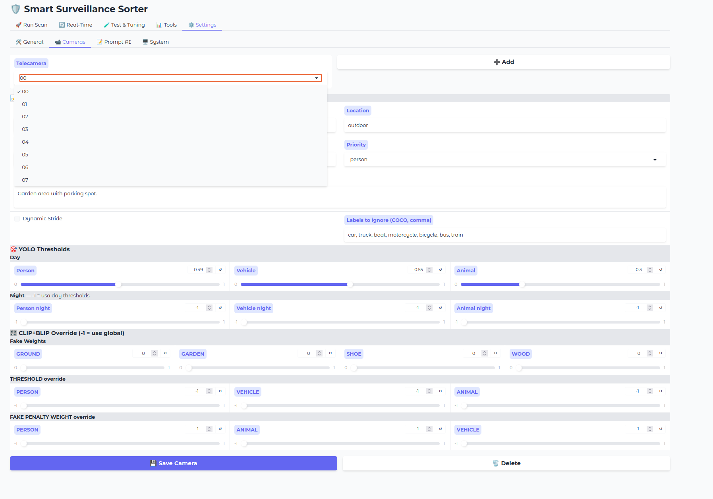

# Camera Configuration Guide

`config/cameras.json` is the most important configuration file — it tells the system how to identify each camera from the filename and how to analyze its videos.

**This file must be configured before the first run.**

>[!TIP]
> 💡 **Recommended**: Edit camera configuration directly from the **WebUI → Settings → Cameras** tab — it provides a visual editor with validation and live preview.  
> Manual JSON editing is also supported for advanced users or automation.



---

## Minimal Configuration

At minimum, each camera needs a name and a search pattern:

```json
{
    "01": {
        "name": "Front Door",
        "search_patterns": ["_01_", "ch01"],
        "location": "outdoor"
    }
}
```

The camera ID (e.g. `"01"`) must match the identifier in your NVR filenames.  
Example: `NVR reo_01_20260301121623.mp4` → camera ID `01`

---

## Full Configuration Reference

```json
{
    "01": {
        "name": "Garden Door",
        "location": "outdoor",
        "search_patterns": ["_01_", "ch01", "Cam01"],
        "priority": "person",
        "desc": "Entrance door, garden area",
        "dynamic_stride": false,
        "filters": {
            "ignore_labels": [],
            "ignore_classes": []
        },
        "thresholds": {
            "person": 0.49,
            "vehicle": 0.55,
            "animal": 0.3
        },
        "thresholds_night": {
            "person": 0.4,
            "vehicle": 0.55,
            "animal": 0.2
        },
        "blip_rules": {
            "FAKE_WEIGHTS": {
                "GROUND": 1.0,
                "GARDEN": 1.0,
                "SHOE": 1.0,
                "WOOD": 1.0
            },
            "THRESHOLD": {
                "PERSON": 0.10,
                "ANIMAL": 0.15,
                "VEHICLE": 0.25
            }
        }
    }
}
```


---

## Parameters

### Basic

| Parameter | Required | Description |
|-----------|----------|-------------|
| `name` | ✅ | Human-readable camera name (used in output folder names) |
| `search_patterns` | ✅ | List of strings to match in the filename to identify this camera |
| `location` | | `outdoor` / `indoor` — used for night detection logic |
| `priority` | | Override classification priority for this camera (default: from `settings.json`) |
| `desc` | | Description of the camera scene — **sent to Vision AI as context** |
| `dynamic_stride` | | `true` to enable dynamic stride for this camera (see [Tuning Guide](tuning-guide.md)) |

>[!TIP]
> **`desc` is important for Vision mode** — it helps the AI understand the scene context. Example: `"Garden area with a wooden fence and gnomes on the lawn"` helps Vision avoid misclassifying garden objects.

---

### Filters

```json
"filters": {
    "ignore_labels": ["bird", "car", "truck"],
    "ignore_classes": ["VEHICLE"]
}
```

| Parameter | Description |
|-----------|-------------|
| `ignore_labels` | YOLO labels to ignore for this camera. Matching detections are skipped entirely. |
| `ignore_classes` | Higher-level categories to ignore (`PERSON`, `ANIMAL`, `VEHICLE`). |

>[!NOTE]
> Labels must match YOLO/COCO class names exactly. Full list of available labels:  
> [COCO Dataset Labels](https://github.com/ultralytics/ultralytics/blob/main/ultralytics/cfg/datasets/coco.yaml)

**Most common labels for surveillance:**
`person`, `car`, `truck`, `bus`, `motorcycle`, `bicycle`, `bird`, `cat`, `dog`, `horse`, `sheep`, `cow`, `bear`

>[!NOTE]
> `ignore_labels` applies to **YOLO, BLIP/CLIP, and Vision** — any detection with an ignored label will not trigger analysis.

**Common use cases:**

| Problem | Solution |
|---------|----------|
| Camera near a tree — YOLO detects `bird` constantly | `"ignore_labels": ["bird"]` |
| Parking camera — vehicles are not relevant | `"ignore_labels": ["car","truck","bus","motorcycle","bicycle"], "ignore_classes": ["VEHICLE"]` |
| Indoor camera — no vehicles expected | `"ignore_classes": ["VEHICLE"]` |

>[!WARNING]
> Use `ignore_labels` carefully — if a real bird or car should be detected on that camera, adding it to ignore_labels will cause false negatives. See [Edge Cases](edge-cases.md) for examples.

---

### Thresholds

```json
"thresholds": {
    "person": 0.49,
    "vehicle": 0.55,
    "animal": 0.3
},
"thresholds_night": {
    "person": 0.4,
    "vehicle": 0.55,
    "animal": 0.2
}
```

YOLO minimum confidence threshold per category. Detections below the threshold are ignored.

- **Lower** = more sensitive, more false positives
- **Higher** = less sensitive, more false negatives
- `thresholds_night` — optional, applied automatically at night (sunrise/sunset from `city` setting)

>[!TIP]
> Default values (`person: 0.49`, `animal: 0.3`) work well for most cameras. Adjust only if you notice systematic false positives or false negatives on a specific camera.

---

### BLIP Rules (CLIP+BLIP engine only)
```json
"blip_rules": {
    "FAKE_WEIGHTS": {
        "GROUND": 1.0,
        "GARDEN": 1.0,
        "SHOE": 1.0,
        "WOOD": 1.0
    },
    "THRESHOLD": {
        "PERSON": 0.10,
        "ANIMAL": 0.15,
        "VEHICLE": 0.25
    }
}
```

**FAKE_WEIGHTS** — per-camera weights for fake/background penalties. Higher weight = stronger penalty when CLIP detects that background element.

**THRESHOLD** — overrides the minimum CLIP+BLIP score required to classify a frame. `-1` in the WebUI means use the global default from `clip_blip_settings.json`.
- Lower = more sensitive (fewer missed detections, more false positives)  
- Higher = more conservative (fewer false positives, more missed detections)

**When to use FAKE_WEIGHTS:**
- Camera with lots of garden/ground visible → increase `GARDEN` and `GROUND`
- Camera with wooden fence or furniture → increase `WOOD`
- Camera with floor/pavement → increase `GROUND`

See [CLIP+BLIP Tuning Guide](blip-clip-config.md) for the full list of available fake keys.

---

## Real World Examples

### Standard outdoor camera

```json
"01": {
    "name": "Front Door",
    "location": "outdoor",
    "search_patterns": ["_01_"],
    "desc": "Entrance door with street visible",
    "dynamic_stride": false,
    "filters": { "ignore_labels": [] },
    "thresholds": { "person": 0.49, "vehicle": 0.55, "animal": 0.3 }
}
```

### Parking camera (vehicles not relevant)
```json
"02": {
    "name": "Parking",
    "location": "outdoor",
    "search_patterns": ["_02_"],
    "desc": "Parking area with 3 cars always present",
    "dynamic_stride": true,
    "filters": {
        "ignore_labels": ["car", "truck", "motorcycle", "bicycle", "bus", "train", "boat"],
        "ignore_classes": ["VEHICLE"]
    },
    "thresholds": { "person": 0.49, "vehicle": 0.55, "animal": 0.3 }
}
```

### Garden camera with trees (bird false positives)
```json
"06": {
    "name": "Garden Gate",
    "location": "outdoor",
    "search_patterns": ["_06_"],
    "desc": "Garden area, street visible through the gate. Wooden fence on the left.",
    "dynamic_stride": false,
    "filters": { "ignore_labels": ["bird"] },
    "thresholds": { "person": 0.49, "vehicle": 0.55, "animal": 0.3 },
    "blip_rules": {
        "FAKE_WEIGHTS": { "GROUND": 1.0, "GARDEN": 1.0, "SHOE": 1.0, "WOOD": 1.0 }
    }
}
```

### Balcony camera with night sensitivity
```json
"04": {
    "name": "Kitchen Balcony",
    "location": "outdoor",
    "search_patterns": ["_04_"],
    "desc": "Balcony overlooking garden. Garden gnomes on the lawn.",
    "dynamic_stride": false,
    "filters": { "ignore_labels": [] },
    "thresholds": { "person": 0.49, "vehicle": 0.55, "animal": 0.3 },
    "thresholds_night": { "person": 0.4, "vehicle": 0.55, "animal": 0.2 }
}
```

---

> For edge cases and advanced tuning see [Edge Cases](edge-cases.md) and [CLIP+BLIP Tuning Guide](blip-clip-config.md)
