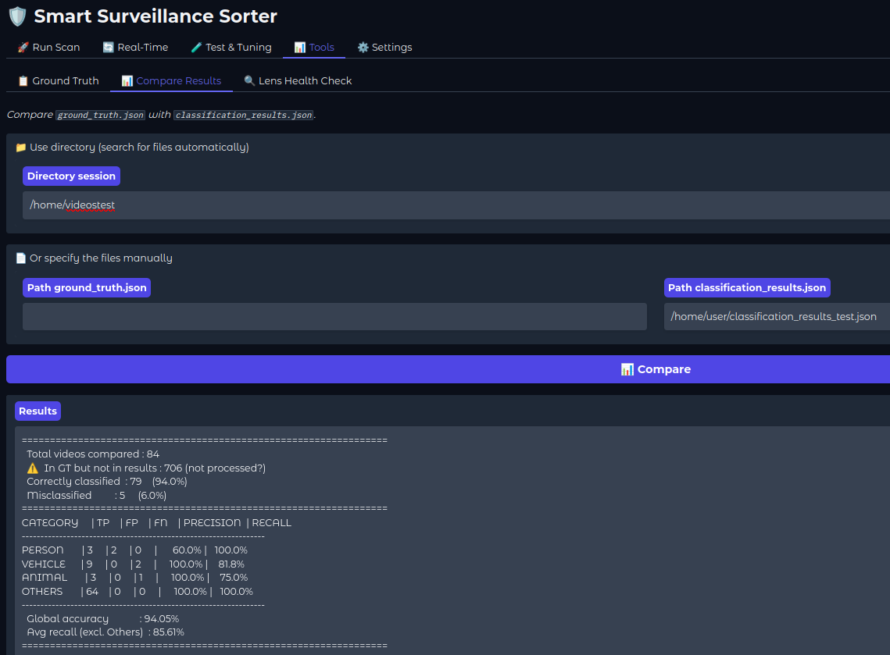

# Testing & Tuning Guide

This guide explains the recommended workflow to test and tune the system on your own footage. Following this process allows you to build a reliable ground truth and iteratively improve accuracy for your specific cameras and environment.

>[!TIP]
> All operations in this guide can also be performed via the **WebUI → Test tab** and **WebUI → Tools tab** without using the CLI.




## Full Tuning Workflow

### Step 1 — First Run with Sort (Copy Mode)

Run the full pipeline in test mode — files are **copied** not moved, so your originals are safe:

```bash
sss --dir /path/to/footage --mode full --refine --blip --test
```

>[!NOTE]
> `--test` automatically uses COPY instead of MOVE and saves `test_metrics.json` with detailed timing and parameters.

---

### Step 2 — Review Extracted Frames

Before watching any video, check the **extracted frames** first — it's much faster than reviewing full videos.

For each sorted folder:
- **People folder** — look at the frames. If you see a shadow, reflection, or object (not a person), open the original video to confirm. If no person → move to `others`.
- **Others folder** — scan frames looking for missed persons, animals, or vehicles. If found → move to the correct folder.
- **Animals folder** — verify it's actually an animal and not a garden object or reflection.

>[!TIP]
> Frames are named after their source video and sorted alongside it — if you sort the folder by filename, frames appear immediately after their video.

---

### Step 3 — Generate Ground Truth

Once you've manually verified and corrected the sorted folders:

```bash
sss --dir /path/to/footage --ground
```

This generates `ground_truth.json` based on the current folder structure. This is your reference for all future comparisons.

>[!WARNING]
> Only run `--ground` after you've finished manual corrections — it reads the current folder structure as the "truth".

---

### Step 4 — Compare Results

```bash
sss --dir /path/to/footage --compare
```

This compares `classification_results.json` against `ground_truth.json` and prints precision/recall per category.

For custom file paths:
```bash
sss --compare --gt /path/to/ground_truth.json --res /path/to/classification_results.json
```

---

### Step 5 — Analyze False Positives and Negatives

Open the JSON result files to understand **why** a video was misclassified.

**For false positives (wrong classification):**

Check `yolo_scan_res.json` for the video — look at:
- `yolo_label` — what YOLO actually detected (e.g. `bird` instead of `animal`)
- `confidence` — how confident YOLO was
- `frame_path` / `crop_path` — open the crop image to see exactly what YOLO saw

**Common patterns:**
| Symptom | Cause | Fix |
|---------|-------|-----|
| 10+ FP with `yolo_label: "bird"` | Piece of wood/stick on camera | `"ignore_labels": ["bird"]` in `cameras.json` |
| FP person at night | Insect on lens, rain reflection | Increase `person_min_conf` or `YOLO_NIGHT_BOOST` |
| FP person = large white dog | YOLO misclassifies dog silhouette | Use `--fallback` or `--vision` |
| FP animal = garden gnome | CLIP confused by shape | Add `"GNOME": ["a photo of a garden gnome"]` to `FAKE_KEYS` |

**For false negatives (missed detection):**

Check if the video appears in `yolo_scan_res.json`:
- If **not present** → YOLO never detected anything → lower `thresholds` or check `ignore_labels`
- If **present** → YOLO found it but BLIP/scoring rejected it → check `clip_blip_res.json` for that video's scores

---

### Step 6 — Apply Fixes and Re-test

After identifying issues, apply fixes in `cameras.json` or `clip_blip_settings.json`.

**Rename result files** before re-running so you don't overwrite them:

```bash
mv json/classification_results.json json/classification_results_before_fix.json
mv json/yolo_scan_res.json json/yolo_scan_res_before_fix.json
```

Then re-run without sort to get fresh results:

```bash
sss --dir /path/to/footage --mode full --refine --blip --no-sort --test
sss --dir /path/to/footage --compare
```

Compare the new results with the previous ones to verify the fix improved things.

---

### Skip YOLO — Test Only BLIP/Vision

If you are satisfied with YOLO results and want to test only the refinement step (BLIP, Fallback, or Vision), keep the `extracted_frames` folder and `yolo_scan_res.json` — the system will automatically resume from YOLO results without re-scanning:
```bash
# Test BLIP only
sss --dir /path/to/footage --mode full --refine --blip --no-sort --test

# Test BLIP + Fallback
sss --dir /path/to/footage --mode full --refine --blip --fallback --no-sort --test

# Test Vision
sss --dir /path/to/footage --mode full --refine --vision --no-sort --test
```

Rename only the `classification_results.json` between runs — leave `yolo_scan_res.json` and `extracted_frames/` untouched.

>[!WARNING]
> Do NOT delete `extracted_frames/` if you want to reuse YOLO results — Vision and BLIP need the extracted frame images to work.

### Step 7 — Iterate

Repeat Steps 5-6 until you're satisfied with the results. Typical iteration order:

1. Fix obvious `ignore_labels` issues (wood, bird, car in parking)
2. Tune `thresholds` per camera
3. Adjust `FAKE_WEIGHTS` for cameras with specific background noise
4. Try `--fallback` or `--vision` if BLIP accuracy is insufficient
5. Adjust `YOLO_NIGHT_BOOST` if night detection is off

---

## Result Files Reference

| File | Description |
|------|-------------|
| `json/yolo_scan_res.json` | Raw YOLO detections — frames, labels, confidence per video (used for resume) |
| `json/clip_blip_res.json` | CLIP+BLIP scores per frame — useful for debugging misclassifications (used for resume)|
| `json/classification_results.json` | Final classification per video (used for resume and real time sort)|
| `json/ground_truth.json` | Ground truth generated from manually sorted folders |
| `json/test_metrics.json` | Timing and parameters for the last test run |
| `json/clip_blip_fallback_res.json` | Fallback Vision results (if `--fallback` was used) (used for resume) |
| `json/vision_cache.json` | Vision mode results cache (for resume) |

>[!TIP]
> Rename result files before changing parameters — this lets you compare before/after without re-running everything from scratch. YOLO results are cached and reused automatically on resume.

>[!WARNING]
> Files marked "used for resume" are automatically reused on the next run — delete them only if you want to start fresh from that step. Deleting or renaming `yolo_scan_res.json` forces a full YOLO re-scan.
---

## Pro Tips

- **Start with `--mode full`** — even if you only care about persons, running full mode helps identify what YOLO is detecting and why
- **Check frames before videos** — opening 500 video files takes hours, scanning 500 frame images takes minutes
- **One change at a time** — when tuning parameters, change one thing per test run so you know exactly what improved or worsened
- **Keep your ground truth safe** — never overwrite `ground_truth.json` accidentally. Once verified, it's your reference forever
- **Dynamic stride on empty cameras** — cameras with long empty footage (parking, garden at night) benefit greatly from `"dynamic_stride": true`
- **`desc` matters for Vision** — the camera description is sent to the AI. "Garden with wooden fence and garden gnomes" helps Vision avoid misclassifying objects

---

## Known Hard Cases

Some cases are genuinely difficult regardless of tuning:

| Case | Why it's hard | Workaround |
|------|---------------|------------|
| Black cat at night | Object too small and dark in 4K frame | Accept as limitation, YOLO crop may catch it |
| Person running fast | High stride misses fast movement | Keep `vid_stride_sec ≤ 0.6` for active cameras |
| Partial body through glass | Vision sees empty frame, YOLO sees the limb | YOLO override handles high-confidence cases |
| Large white dog | Similar silhouette to person from above | Use `--fallback` or `--vision` |
| Spider web on lens | Covers entire frame, triggers everything | Clean the lens  or add to `FAKE_KEYS` |
