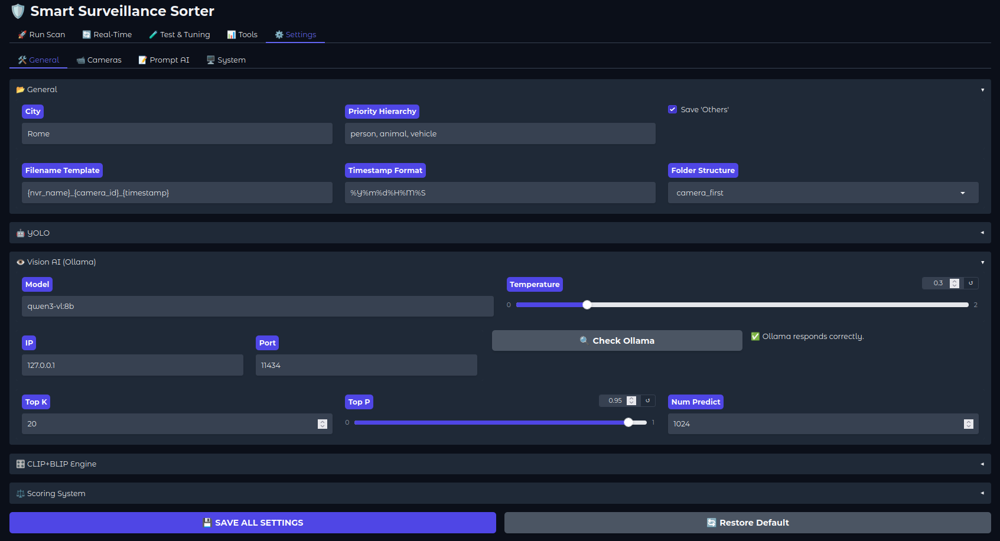
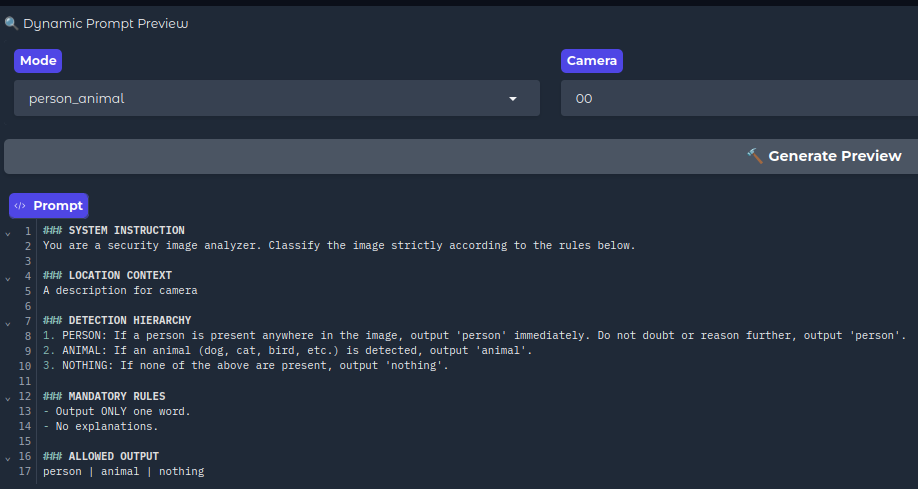

# Tuning Guide

All settings are stored in `config/settings.json` and can be edited via the WebUI (Settings tab) or directly in the file.



---

## Contents
- [General Settings](#general-settings)
- [Storage Settings & Filename Template](#storage-settings--filename-template)
- [YOLO Settings](#yolo-settings)
- [Vision Settings (Ollama)](#vision-settings-ollama)
- [Scoring System](#scoring-system)
- [Output Mapping](#output-mapping)
- [CLIP+BLIP Settings](#clipblip-settings)
- [Vision Prompt Tuning](#vision-prompt-tuning)

---
## General Settings

```json
"city": "Rome"
```
Used for weather-based night detection (sunrise/sunset calculation). Change with your city, will calculate automatically. Yolo and ClipBlip use different score system for night and day

```json
"classification_settings": {
    "priority_hierarchy": ["person", "animal", "vehicle"],
    "save_others": true
}
```
- **priority_hierarchy** — order of classification priority. If a video contains both a person and an animal, it will be classified as `person`.
- **save_others** — if `true`, unclassified videos are saved in the `others` folder instead of remain in the input dir unsorted.

---

## Storage Settings & Filename Template

```json
"storage_settings": {
    "filename_template": "{nvr_name}_{camera_id}_{timestamp}",
    "timestamp_format": "%Y%m%d%H%M%S",
    "structure_type": "camera_first"
}
```

### Filename Template
The template tells the system how to parse your NVR filenames to extract the camera ID and timestamp.

| Placeholder | Description |
|-------------|-------------|
| `{nvr_name}` | NVR or recorder name (can contain spaces) |
| `{camera_id}` | Camera identifier (e.g. `00`, `01`, `CAM1`) |
| `{timestamp}` | Date/time string (digits only) |

**Common NVR formats:**

| NVR Brand | Example Filename | Template | Timestamp Format |
|-----------|-----------------|----------|-----------------|
| Reolink (default) | `NVR reo_00_20260228063426.mp4` | `{nvr_name}_{camera_id}_{timestamp}` | `%Y%m%d%H%M%S` |
| Hikvision | `CH01_20260228063426.mp4` | `CH{camera_id}_{timestamp}` | `%Y%m%d%H%M%S` |
| Dahua | `2026-02-28_06-34-26_cam1.mp4` | `{timestamp}_{nvr_name}{camera_id}` | `%Y-%m-%d_%H-%M-%S` |
| Generic | `CAM1-20260228-063426.mp4` | `{nvr_name}{camera_id}-{timestamp}` | `%Y%m%d-%H%M%S` |

### Output Structure
```json
"structure_type": "camera_first"
```
- **camera_first** — `output/Camera_01/people/video.mp4`
- **category_first** — `output/people/Camera_01/video.mp4`

---

## YOLO Settings

```json
"yolo_settings": {
    "model_path": "yolov8l",
    "device": "cuda",
    "num_occurrence": 3,
    "time_gap_sec": 3,
    "vid_stride_sec": 0.6
}
```

| Parameter | Default | Description |
|-----------|---------|-------------|
| `model_path` | `yolov8l` | YOLO model size. `yolov8l` is recommended — `yolov8n` misses too many detections (high FN), `yolov8x` over-detects persons everywhere including trees and shadows (high FP). `yolov8m` is a valid alternative if VRAM is limited. |
| `device` | `cuda` | `cuda` for GPU, `cpu` for CPU |
| `num_occurrence` | `3` | Minimum number of detections required to classify a video. Also controls how many frames are saved for BLIP/Vision analysis. Higher = more conservative, fewer false positives. Also used as early exit threshold — once reached, YOLO stops analyzing the video. |
| `time_gap_sec` | `3` | Minimum seconds between two detections to count as separate occurrences. Prevents the same object being counted multiple times in consecutive frames. |
| `vid_stride_sec` | `0.6` | Seconds between analyzed frames — lower = more accurate but slower. |

### Dynamic Stride Settings
Automatically adjusts the analysis speed based on what YOLO finds:

```json
"dynamic_stride_settings": {
    "warmup_sec": 5,
    "stride_fast_sec": 1.0,
    "pre_roll_sec": 20,
    "cooldown_sec": 5
}
```

| Parameter | Default | Description |
|-----------|---------|-------------|
| `warmup_sec` | `5` | Initial high-sensitivity scan at the start of each video. Analyzes ~4 frames/sec regardless of `vid_stride_sec` — ensures nothing is missed at the beginning. |
| `stride_fast_sec` | `1.0` | Fast stride used during "cruise" phase when nothing is detected. Higher = faster but may miss fast-moving objects. Only active for cameras with `dynamic_stride: true` in `cameras.json`. |
| `pre_roll_sec` | `20` | After warmup, keeps slow scan (`vid_stride_sec`) for this many seconds before switching to fast stride. Gives time for slow-moving objects to appear. |
| `cooldown_sec` | `5` | After a detection ends, stays on slow stride for this many seconds to catch any remaining activity. |

>[!NOTE]
> Dynamic stride is enabled per-camera in `config/cameras.json` with `"dynamic_stride": true`. Cameras without this flag always use `vid_stride_sec`.

**Tuning tips:**
- Empty cameras with few detections → increase `stride_fast_sec` (1.5-2.0) for speed
- Cameras with fast-moving objects → decrease `vid_stride_sec` (0.3-0.4)
- High false positive rate → increase `num_occurrence` (4-5)

### Detection Groups
```json
"detection_groups": {
    "PERSON": ["person", "human"],
    "ANIMAL": ["dog", "cat", "bird", "horse", "sheep", "cow", "bear"],
    "VEHICLE": ["car", "truck", "motorcycle", "bicycle", "bus"]
}
```
YOLO class labels mapped to the system categories. Add or remove labels as needed.

> [!TIP]
> If your camera has trees/bushes, YOLO may detect `bird` with high confidence causing early exit before a person is detected. Use `ignore_labels: ["bird"]` in the camera config. See [Edge Cases](edge-cases.md) for more examples.

---

## Vision Settings (Ollama)

```json
"vision_settings": {
    "model_name": "qwen3-vl:8b",
    "temperature": 1,
    "num_predict": 1024,
    "top_k": 20,
    "top_p": 0.95,
    "ollama_conf": {
        "ip": "127.0.0.1",
        "port": 11434
    }
}
```

| Parameter | Default | Description |
|-----------|---------|-------------|
| `model_name` | `qwen3-vl:8b` | Ollama vision model to use |
| `temperature` | `1.0` | Creativity — lower = more deterministic, but longer thinking |
| `num_predict` | `1024` | Max tokens for the model response (includes thinking) |
| `top_k` | `20` | Number of candidate tokens considered at each step |
| `top_p` | `0.95` | Cumulative probability threshold for token selection |

>[!NOTE]
> Lowering `temperature` below `0.3` significantly increases thinking time without improving accuracy in most cases. Default `0.3` is recommended.

>[!TIP]
>**Remote Ollama**: change `ip` and `port` to use a remote server.

---

## Scoring System

```json
"scoring_system": {
    "yolo_override": {
        "person_min_conf": 0.58,
        "min_total_score_to_skip_override": 1.2
    }
}
```

### YOLO Person Override
When Vision says `others` but YOLO detected a person with high confidence, the override forces the classification to `person`.

| Parameter | Default | Description |
|-----------|---------|-------------|
| `person_min_conf` | `0.58` | Minimum YOLO confidence to trigger person override |
| `min_total_score_to_skip_override` | `1.2` | If Vision score is above this, override is skipped |

>[!NOTE]
> Lowering `person_min_conf` reduces missed persons (FN) but increases false alarms (FP) from shadows and reflections. `0.58` is the recommended balance.

---

## Output Mapping

```json
"output_mapping": {
    "person": "People",
    "animal": "Animals", 
    "vehicle": "Vehicles",
    "others": "Others"
}
```
Customize the output folder names for each category.

---


## CLIP+BLIP Settings

Advanced per-camera tuning for the CLIP+BLIP engine.

> See [CLIP+BLIP Tuning Guide](blip-clip-config.md) for detailed documentation.

---

## Vision Prompt Tuning

The prompt sent to the Vision model is assembled dynamically from components stored in `config/prompts.json`. It is never a static string — it adapts to the current scan mode, camera configuration, and pipeline stage.

### Prompt Structure

Every prompt is built from these components:

- **System Instruction** — the base role given to the model
- **Location Context** — the camera `desc` field from `cameras.json`
- **Detection Hierarchy** — built dynamically from active classes (filtered by `mode` and `ignore_labels`)
- **Mandatory Rules** — output format constraints
- **Allowed Output** — the exact list of valid responses the model can return

### Pipeline Variants

| Template | When used |
|----------|-----------|
| `standard` | Normal BLIP fallback / Vision scan |
| `with_crop` | When a crop is available from YOLO |
| `fallback` | Deep scan when no detections found |
| `clean_check` | Lens cleanliness check |

### Dynamic Class Filtering

The `Detection Hierarchy` is built at runtime based on:
1. **`mode`** — `full` includes PERSON/ANIMAL/VEHICLE, `person` only PERSON, etc.
2. **`ignore_labels`** from the camera config — if a camera ignores `car/truck`, VEHICLE is removed from the hierarchy entirely

This means two cameras can receive completely different prompts even in the same scan.

### Editing Prompts

Use the **WebUI → Settings → Prompt AI** tab to edit all components visually and preview the exact assembled prompt before running a scan.



> [!WARNING]
> The `templates` section uses Python `.format()` placeholders like `{hierarchy}` and `{allowed_outputs}` — do not remove or rename them or the prompt assembly will fail.
