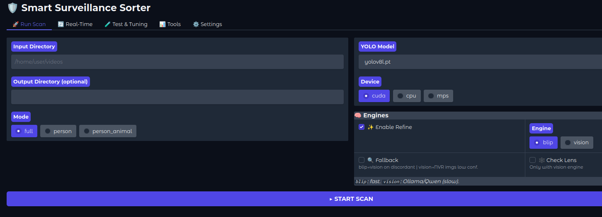
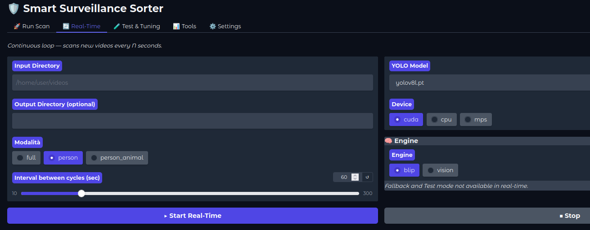
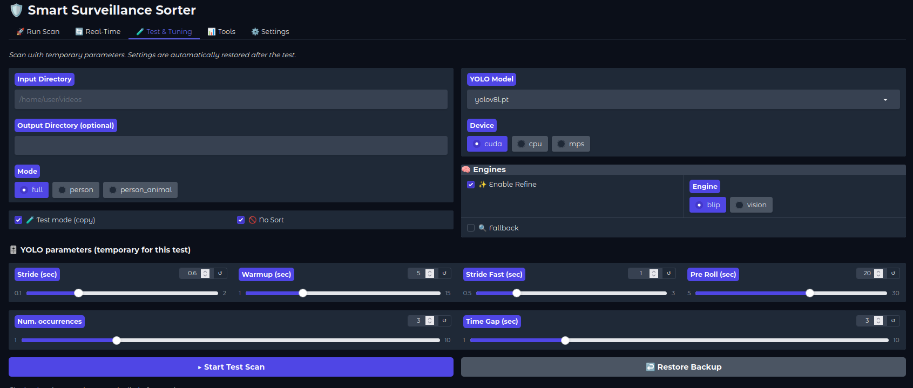
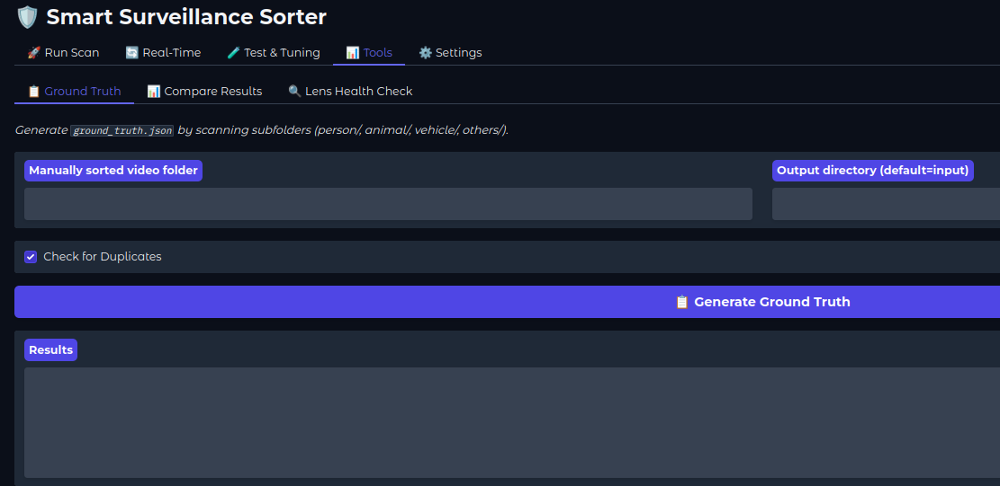
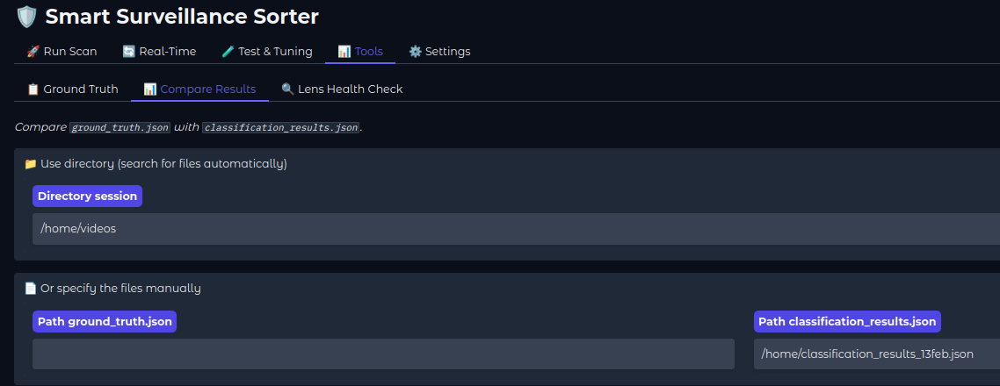
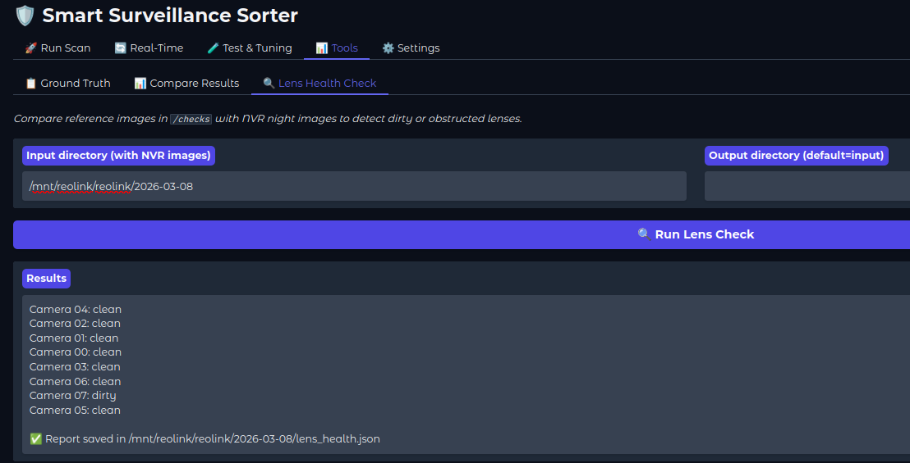
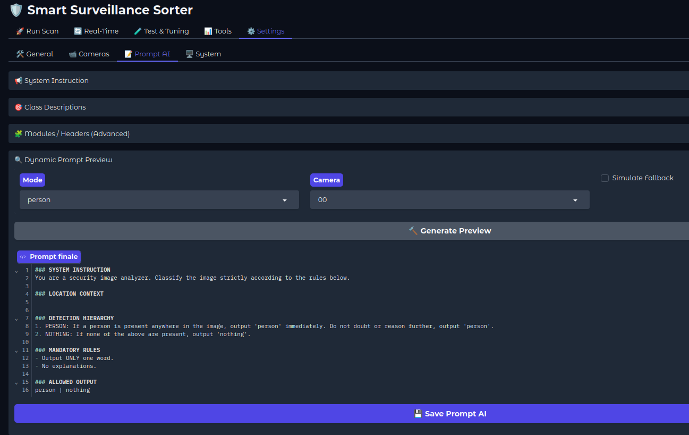
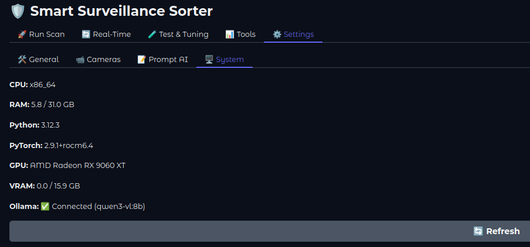

# Web Interface (WebUI)

The WebUI provides a graphical interface to run scans, tune parameters, and manage settings without using the CLI. It is built with Gradio and runs locally in your browser.

**Launch:**
```bash
sss-webui
# or
./run.sh   #linux
.\run.bat  #win
```

The interface opens automatically at `http://localhost:7860`.

---

## Tabs Overview

- [Run Scan](#run-scan)
- [Real-Time](#real-time)
- [Test & Tuning](#test--tuning)
- [Tools](#tools)
- [Settings](#settings)

---

## Run Scan



The main scan tab. Configure and launch a full pipeline run.

**Left panel:**
- **Input Directory** — folder containing videos and NVR images to process
- **Output Directory** *(optional)* — where to sort results; defaults to input directory
- **Mode** — `full` / `person` / `person_animal` — which categories to search for

**Right panel:**
- **YOLO Model** — select the model file (yolov8l.pt default)
- **Device** — `cuda` / `cpu` / `mps`
- **Engines** — enable Refine, select engine (`blip` or `vision`), enable Fallback, enable Check Lens

>[!NOTE]
> `blip`: fast, local. `vision`: slower, requires Ollama running. Fallback and Check Lens require vision engine.

---

## Real-Time



Continuous monitoring mode — scans for new videos every N seconds.

**Left panel:**
- **Input / Output Directory**
- **Modalità** — mode selection
- **Interval between cycles (sec)** — how often to check for new videos (10–300s)

**Right panel:**
- **YOLO Model / Device / Engine** — same as Run Scan

>[!NOTE]
>Fallback and Test mode are not available in real-time. Settings are read from `settings.json` and `cameras.json` at each cycle.

>See [Real-Time & Resume](realtime-resume.md) for use case examples and workflow.

---

## Test & Tuning



Run a scan with **temporary parameters** without modifying your saved settings. A backup is created automatically before each test scan and can be restored with **Restore Backup**.

**Left panel:**
- **Input / Output Directory**
- **Mode** — full / person / person_animal
- **Test mode (copy)** — copies files instead of moving them *(does not sort)*
- **No Sort** — runs the pipeline without sorting output

**Right panel:**
- **YOLO Model / Device / Engines / Fallback** — same as Run Scan
- **YOLO parameters (temporary)** — Stride, Warmup, Stride Fast, Pre Roll, Num Occurrences, Time Gap — these values override `settings.json` for this test only and are restored afterwards

>[!TIP]
>This is the recommended tab for tuning YOLO parameters — change values, run, compare results, adjust without ever touching your saved configuration.

> See [Testing Guide](testing-guide.md) for the full tuning workflow.

---

## Tools

Three sub-tabs for benchmark and accuracy workflows.

### Ground Truth



Generates `ground_truth.json` by scanning a manually sorted folder (subfolders: `person/`, `animal/`, `vehicle/`, `others/`).

- **Manually sorted video folder** — path to your reference folder
- **Output directory** *(default = input)* — where to save `ground_truth.json`
- **Check for Duplicates** — detects duplicate filenames across subfolders

> See [Testing Guide](testing-guide.md) for the full ground truth workflow.


### Compare Results



Compares `ground_truth.json` with `classification_results.json` and outputs precision/recall/accuracy metrics.

- **Use directory** — point to the session folder and files are found automatically
- **Or specify manually** — provide explicit paths to both JSON files

>[!TIP]
> Use this after every test run to immediately see TP/FP/FN per category without using the CLI.


### Lens Health Check

Analyzes camera lens cleanliness using Vision models (Ollama). Scans a folder of NVR footage and reports which cameras have dirty, obstructed, or degraded lenses.
- **Input directory** — path to your NVR footage folder
- **Output directory** *(default = input)* — where to save `lens_health.json`

> See [Lens Health Check Guide](lens-health.md) for setup, prompt customization, and known limitations.

---

## Settings

Four sub-tabs covering all configurable parameters. Changes are saved to `settings.json`,`cameras.json`,`clip_blip_settings.json`,`prompts.json`.

### General


Global parameters organized in collapsible sections:

- **General** — City (for sunrise/sunset calculation), Priority Hierarchy, Save Others, Filename Template, Timestamp Format, Folder Structure
- **YOLO** — Model name, Device, Video Stride, Num Occurrence, Time Gap, Dynamic Stride parameters (Warmup, Stride Fast, Pre Roll, Cooldown)
- **Vision AI (Ollama)** — Model, Temperature, IP, Port, Top K, Top P, Num Predict — plus **Check Ollama** button to verify connectivity before running
- **CLIP+BLIP Engine** — global model and engine parameters
- **Scoring System** — global BLIP_BOOST, THRESHOLD, FAKE_PENALTY_WEIGHT defaults

>[!TIP]
> **Check Ollama** button — click before launching a vision run to verify that Ollama is reachable at the configured IP/port. Shows "validated" or "not validated" inline.

### Cameras


Per-camera configuration. Select a camera from the dropdown or add a new one.

Each camera exposes:
- **Location, Priority, Description (desc), Dynamic Stride**
- **Labels to ignore** — COCO label names, comma-separated
- **YOLO Thresholds** — day and night confidence per category (`-1` = use global)
- **CLIP+BLIP Override** — Fake Weights per key, THRESHOLD override, FAKE_PENALTY_WEIGHT override per category (`-1` = use global)

>[!NOTE]
> All camera overrides use `-1` as "inherit from global" — only set values you want to customize. This keeps per-camera configs minimal and readable.

>See [Camera Configuration](cameras-config.md) and [Edge Cases](edge-cases.md) for real-world tuning examples.

### Prompt AI



Edit the Vision AI prompt components without touching JSON files directly:

- **System Instruction** — the base system prompt sent to the model
- **Class Descriptions** — per-class detection descriptions
- **Modules / Headers (Advanced)** — Mission Crop Header, Fallback Header, Clean Check Header — the specialized prompt prefixes used in different pipeline stages

**Dynamic Prompt Preview** — generate and inspect the exact prompt that will be sent to the model:
- Select **Mode** (full / person / person_animal / clean_check)
- Toggle **Simulate Fallback** to preview different pipeline stages
- Select **Camera** — the prompt adapts based on the camera's `ignore_labels` and `desc` fields
- Click **Generate Preview** → the final assembled prompt appears in the code viewer below

>[!TIP]
> Use the preview before changing prompts — what you see is exactly what the model receives, including location context, detection hierarchy, and mandatory rules.

### System



### System
Displays system information: CPU, RAM, GPU, VRAM, Python and PyTorch versions, and Ollama connection status. Use this tab to verify that the GPU is correctly detected and that Ollama is reachable before starting a scan.
